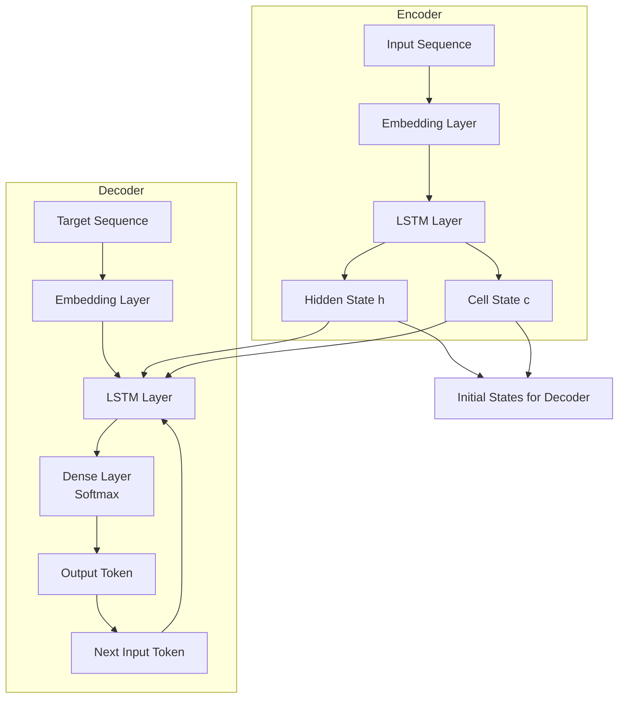
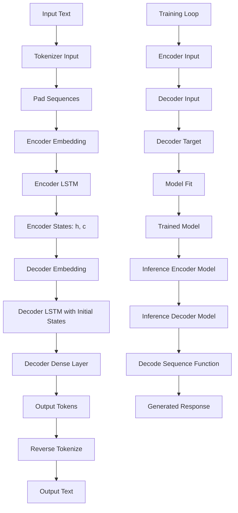

# Mini ChatBot Using LSTM Seq2Seq Model

This project implements a simple chatbot using a Sequence-to-Sequence (Seq2Seq) model with Long Short-Term Memory (LSTM) networks in TensorFlow/Keras. The model is trained on a dialogue dataset to generate responses to user inputs.

## Overview

The notebook `model_training.ipynb` contains the complete implementation, from data preprocessing to model training and inference. Below is a detailed explanation of each step.

## Prerequisites

- Python 3.x
- TensorFlow 2.x
- Pandas
- NumPy
- Jupyter Notebook

Install dependencies:
```bash
pip install tensorflow pandas numpy
```

## Dataset

The model uses a tab-separated dialogue dataset (`dialog.txt` or `dialog_tab.txt`). Each line contains an input text and corresponding output text separated by a tab.

- **Loading Data**: The dataset is loaded using Pandas, reading the tab-separated file.
- **Preprocessing**: 
  - Input texts are tokenized and converted to sequences.
  - Target texts are wrapped with `<start>` and `<end>` tokens.
  - Sequences are padded to ensure uniform length.

## Model Architecture

The Seq2Seq model consists of an Encoder-Decoder architecture using LSTM layers.

### Encoder
- Takes input sequences and processes them through an LSTM layer.
- Outputs the final hidden and cell states, which capture the context of the input.

### Decoder
- Takes the encoder states as initial states.
- Generates output sequences token by token, using the previous output as input for the next step.
- Uses a Dense layer with softmax activation for token prediction.

### Encoder-Decoder Block Diagram



This diagram shows how the encoder processes the input sequence to produce context states, which are then used to initialize the decoder for generating the output sequence.

### General Flow Mermaid Diagram



## Training

- **Parameters**:
  - Batch size: 64
  - Epochs: 200
  - Latent dimension: 256

- **Data Preparation**:
  - Encoder input: Padded input sequences
  - Decoder input: Padded target sequences (shifted by one for teacher forcing)
  - Decoder target: Decoder input shifted by one position

- **Training Process**:
  - The model is compiled with Adam optimizer and sparse categorical cross-entropy loss.
  - Trained on 80% of data, validated on 20%.
  - GPU acceleration is utilized if available.

## Inference

- **Encoder Model**: Used to encode input sentences and get initial states.
- **Decoder Model**: Generates output sequences token by token.
- **Decode Function**: 
  - Encodes input sentence.
  - Starts with `<start>` token.
  - Predicts next token iteratively until `<end>` token or max length.
  - Converts token indices back to words.

## Usage

1. Run the notebook cells in order.
2. Train the model (may take time depending on hardware).
3. Use the `decode_sequence` function to generate responses:
   ```python
   response = decode_sequence("Hello, how are you?")
   print(response)
   ```

## Results

The model can generate coherent responses based on the training data. Example:
- Input: "hi, how are you doing?"
- Output: "i'm fine. how about yourself?"

Note: The model's performance depends on the quality and size of the training data. For better results, use larger datasets or fine-tune hyperparameters.

## Files

- `model_training.ipynb`: Main notebook with implementation
- `dialog.txt`: Original dialogue dataset
- `README.md`: This file

## Future Improvements

- Use attention mechanisms for better performance
- Implement beam search for inference
- Train on larger, more diverse datasets
- Add preprocessing for better text cleaning
